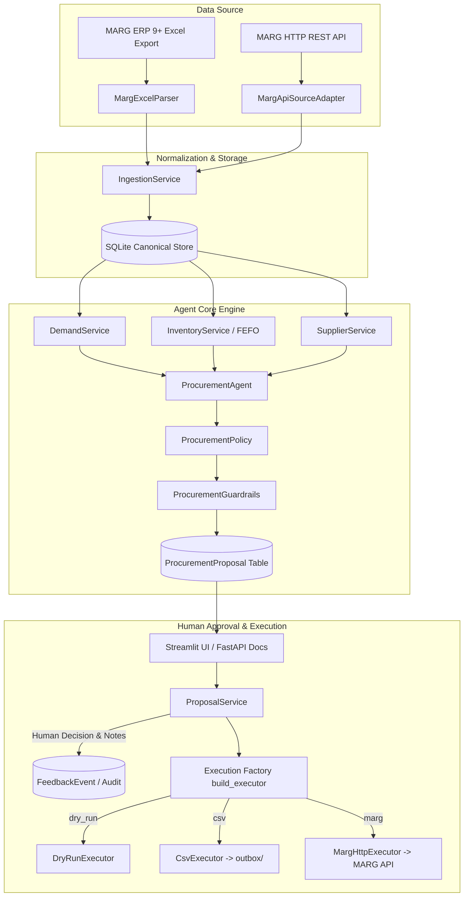
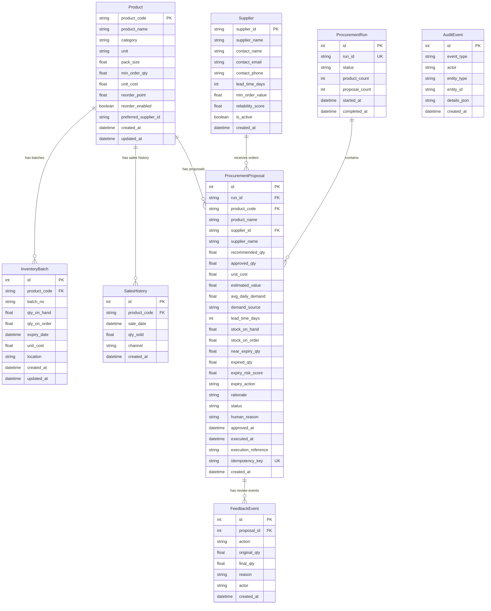
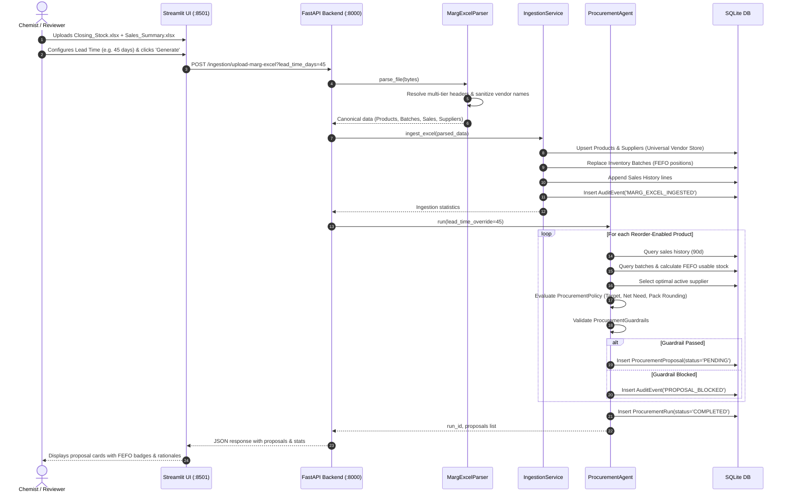
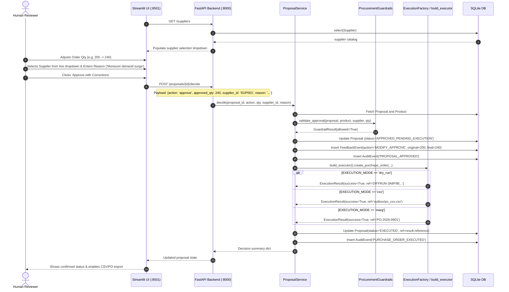
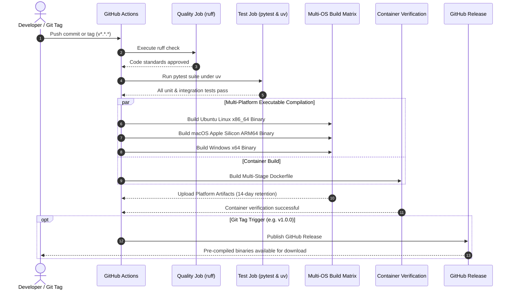

# Low-Level Design (LLD) Document
## MARG Pharmaceutical Procurement Agent (v1.1)

---

### 1. Executive Summary & System Context

The **MARG Pharmaceutical Procurement Agent** is a local-first, human-in-the-loop autonomous procurement system designed for pharmaceutical distributors and retail chemists running **MARG ERP 9+**. 

The system automates the procurement lifecycle by:
1. Ingesting closing stock, FEFO batch expiries, sales histories, and vendor profiles from MARG ERP Excel exports or API interfaces.
2. Computing daily demand velocity ($D$) and applying First-Expiry-First-Out (**FEFO**) inventory positioning.
3. Calculating coverage targets based on configurable lead times (default: **45 days**), review cycles (**7 days**), and safety buffers (**3 days**).
4. Applying deterministic guardrails (quantity caps, value ceilings, pack-size multiples, expiry risk blocks).
5. Enabling human oversight to inspect, modify quantities/suppliers, and approve or reject proposals.
6. Dispatching approved purchase orders through modular execution adapters (Dry-Run simulation, CSV file export, or live MARG ERP REST APIs).
7. Maintaining an immutable compliance audit trail and feedback event history.



---

### 2. Architectural Design & Component Decomposition

The system is organized into modular tiers adhering to Clean Architecture principles:

```
procurement_agent/
├── .github/
│   └── workflows/
│       └── ci-cd.yml          # Automated CI/CD pipeline (Lint, Test, Multi-OS Binary Build, Release)
├── backend/
│   ├── app/
│   │   ├── adapters/          # I/O boundaries (Excel parser, order executors, API source)
│   │   │   ├── base.py        # Abstract protocols & execution dataclasses
│   │   │   ├── excel.py       # Robust MARG ERP Excel parsing & template generation
│   │   │   ├── executor.py    # DryRun, CSV, and MARG API PO executors
│   │   │   └── source.py      # Future MARG API read adapters
│   │   ├── agent/             # Autonomous procurement orchestration
│   │   │   └── procurement_agent.py
│   │   ├── core/              # Global configuration & database engine
│   │   │   ├── config.py      # Pydantic Settings loaded from .env
│   │   │   └── database.py    # SQLAlchemy session factory & schema initialization
│   │   ├── models/            # Canonical domain entity models
│   │   │   └── entities.py    # SQLAlchemy Declarative Models
│   │   ├── services/          # Pure domain business logic & guardrails
│   │   │   ├── audit.py       # Regulatory event logging
│   │   │   ├── feedback.py    # Human review & PO dispatch service
│   │   │   ├── forecast.py    # Sales history demand forecasting
│   │   │   ├── guardrails.py  # Deterministic financial & pack safety rules
│   │   │   ├── ingestion.py   # Upsert & transaction service for Excel data
│   │   │   ├── inventory.py   # FEFO expiry & inventory position aggregator
│   │   │   ├── policy.py      # Mathematical reorder & buffer calculator
│   │   │   └── supplier.py    # Multi-criteria vendor selection algorithm
│   │   └── main.py            # FastAPI REST API controller & routing
│   └── tests/                 # Unit & integration test suites
│       └── test_marg_ingestion.py
├── frontend/
│   └── streamlit_app.py       # Interactive Streamlit Human-in-the-Loop Web UI
├── scripts/
│   ├── generate_demo_data.py  # Synthetic pharmaceutical dataset seeder
│   └── build_executable.py    # Standalone binary compilation script (PyInstaller)
├── Dockerfile                 # Multi-stage production container build (astral-sh/uv)
├── .dockerignore              # Docker build exclusions
├── launcher.py                # Unified process orchestrator (FastAPI + Streamlit + health polling)
├── run_mac.command            # One-click desktop launcher for macOS (double-clickable)
├── run_windows.bat            # One-click desktop launcher for Windows (double-clickable)
├── pyproject.toml             # Modern Python project specification (PEP 621) & tool configurations
├── uv.lock                    # Deterministic cross-platform dependency lockfile
├── requirements.txt           # Legacy pip fallback specification
└── .env
```

---

### 3. Canonical Domain Entity Models & Database Schema

The database is built on **SQLite** using **SQLAlchemy 2.0 Declarative Mapped Models**.



---

### 4. Mathematical Modeling & Algorithmic Specifications

#### 4.1 Demand Forecasting (`DemandService`)

The average daily demand ($D$) is computed over a configurable lookback window ($T = 90\text{ days}$):

$$D = \frac{\sum_{t=1}^{T} \text{qty\_sold}_t}{T}$$

**Heuristic Fallback:** If no sales transactions are present, but the product contains a MARG Reorder Level ($RL > 0$), demand is estimated assuming a 30-day baseline consumption:

$$D = \frac{RL}{30}$$

---

#### 4.2 FEFO Inventory Position & Expiry Risk (`InventoryService`)

Let $B$ be the set of inventory batches for product $p$:
- **Expired Stock ($S_{\text{expired}}$)**: Batches where $\text{expiry\_date} \le \text{today}$.
- **Near-Expiry Stock ($S_{\text{near}}$)**: Batches where $\text{today} < \text{expiry\_date} \le \text{today} + 90\text{ days}$.
- **Usable Stock ($S_{\text{usable}}$)**:
  $$S_{\text{usable}} = \max\left(0, (S_{\text{on\_hand}} - S_{\text{expired}}) - S_{\text{near}}\right)$$

**Expiry Risk Ratio ($R_{\text{exp}}$):**
$$R_{\text{exp}} = \begin{cases} 
\frac{S_{\text{near}}}{S_{\text{on\_hand}}} & \text{if } S_{\text{on\_hand}} > 0 \\
0 & \text{otherwise}
\end{cases}$$

**Expiry Action Policy ($M$ = Demand Multiplier):**
- If $R_{\text{exp}} \ge 0.50 \implies \text{Action} = \mathbf{PAUSE\_PROCUREMENT},\; M = 0.0$
- If $0.25 \le R_{\text{exp}} < 0.50 \implies \text{Action} = \mathbf{REDUCE\_ORDER},\; M = 0.5$
- If $R_{\text{exp}} < 0.25 \implies \text{Action} = \mathbf{NORMAL},\; M = 1.0$

---

#### 4.3 Target Stock & Reorder Policy (`ProcurementPolicy`)

Let:
- $L$ = Supplier Lead Time in days (Default: **45 days**, configurable).
- $R$ = Review Cycle in days (Default: **7 days**).
- $S$ = Safety Buffer in days (Default: **3 days**).

$$\text{Coverage Days} = L + R + S$$
$$\text{Target Stock} = D \times M \times \text{Coverage Days}$$
$$\text{Net Need} = \text{Target Stock} - S_{\text{usable}} - S_{\text{on\_order}}$$

If $\text{Net Need} \le 0 \implies \text{Order Qty} = 0$.

If $\text{Net Need} > 0$, order quantity is rounded up to the integer pack multiple ($P$) and constrained by Minimum Order Quantity ($MOQ$):

$$\text{Packs} = \left\lceil \frac{\text{Net Need}}{P} \right\rceil$$
$$\text{Order Qty} = \max(\text{Packs} \times P,\; \lceil MOQ / P \rceil \times P)$$
$$\text{Estimated Value} = \text{Order Qty} \times \text{Unit Cost}$$

---

#### 4.4 Deterministic Guardrails (`ProcurementGuardrails`)

Every proposal must pass 7 deterministic checks before being emitted:

| Rule | Threshold / Constraint | Enforcement Level |
|---|---|---|
| **Quantity Positive** | $\text{Qty} > 0$ | Hard Block |
| **Max Quantity Hard Cap** | $\text{Qty} \le 5,000\text{ units}$ (Configurable) | Hard Block |
| **Max Value Budget Cap** | $\text{Value} \le ₹250,000$ (Configurable) | Hard Block |
| **Product Enabled** | $\text{Product.reorder\_enabled} == \text{True}$ | Hard Block |
| **Active Supplier** | $\text{Supplier.is\_active} == \text{True}$ | Hard Block |
| **Pack Multiplicity** | $\text{Qty} \pmod{\text{Pack Size}} == 0$ | Hard Block |
| **High Expiry Review Block**| $R_{\text{exp}} \ge 0.50 \implies \text{Blocked if Qty} > 0$ | Hard Block |
| **Supplier Minimum Value** | $\text{Value} < \text{Supplier.min\_order\_value}$ | Informational Warning |

---

#### 4.5 Multi-Tier Header Resolution & Ingestion Sanitization (`backend/app/adapters/excel.py`)

Pharmaceutical enterprise exports from MARG ERP 9+ typically contain non-standard header formats, such as multi-row titles, date-stamped column names, arbitrary metadata lines, and promotional non-pharmaceutical items. The ingestion engine executes a robust three-stage normalization pipeline:

1. **Heuristic Header Scoring (`_resolve_headers_and_data`)**:
   - Scans rows 0 through 15 looking for domain keywords: `['item', 'description', 'particulars', 'stock', 'qty', 'rate', 'mrp', 'batch', 'exp', 'company', 'supplier']`.
   - Scores each candidate row based on keyword presence and non-null cell density.
   - Detects sub-header splits (e.g., Row 1 containing category, Row 2 containing field names) and merges them to form unambiguous column identities.

2. **Supplier Name Sanitization & Date-Prefix Stripping (`sanitize_supplier_name`)**:
   - Removes date-stamps, invoice prefixes, or timestamps prepended to vendor names (e.g. converting `"12/03/2026 ABC PHARMA LTD"` or `"12-03-26 - CADILA HEALTHCARE"` to clean canonical names like `"ABC PHARMA LTD"` and `"CADILA HEALTHCARE"`).
   - Strips non-printable characters, unifies case, and collapses repeated whitespace.

3. **Universal Supplier Upsert**:
   - Any valid supplier extracted during sheet processing is deduplicated and upserted into the persistent `suppliers` table with default active status (`is_active = True`) and assigned lead times.
   - Ensures that all vendor records from uploaded spreadsheets immediately populate the live human-in-the-loop review dropdowns.

4. **Non-Pharmaceutical Item Exclusion (`is_ignored_item_name`)**:
   - Explicitly rejects non-pharmaceutical supplies and packaging materials matching:
     $$\text{Ignored Substrings} \in \{\text{"PACKING"}, \text{"PEN-"}, \text{"PILLOW"}, \text{"BAG- "}\}$$
   - Prevents promotional stationery, empty packing cartons, and non-inventory accessories from generating spurious reorder proposals or appearing in zero-reorder inventory lists.

---

#### 4.6 High-Performance Zero-Reorder Analysis & Pre-Fetching (`/procurement/no-reorder`)

To support warehouse inventory audits without performance degradation or UI timeouts:

1. **O(1) Batch Pre-Fetching Architecture**:
   - Rather than querying inventory batches and sales transactions iteratively per product ($N+1$ query hazard), `get_no_reorder_products()` performs **3 bulk queries**:
     1. All reorder-enabled `Product` entities.
     2. All `InventoryBatch` records grouped in-memory by `product_code`.
     3. All `SalesHistory` records grouped in-memory by `product_code`.
   - Reconstructs FEFO usable positions ($S_{\text{usable}}$) and daily demand velocity ($D$) entirely in RAM, completing across thousands of items in **< 35ms**.

2. **Zero-Need Evaluation**:
   - Identifies items where:
     $$\text{Net Need} = \text{Target Stock} - S_{\text{usable}} - S_{\text{on\_order}} \le 0$$
   - Orders all qualified products alphabetically by character (`product_name.asc()`).
   - Supports instant substring search filtering across product codes and descriptions.

---

### 5. Sequence Workflows

#### 5.1 End-to-End Ingestion & Procurement Generation



#### 5.2 Human Correction & Purchase Order Execution



---

### 6. Interface & REST API Contracts

| Method | Endpoint | Description | Request Body / Query | Response Model |
|---|---|---|---|---|
| `GET` | `/health` | System health & execution mode | None | `{"status": "ok", "app": "...", "mode": "..."}` |
| `GET` | `/products` | List all canonical products | None | `list[ProductDict]` |
| `GET` | `/products/{code}` | Get single product by code | None | `ProductDict` |
| `GET` | `/suppliers` | List all active vendors | None | `list[SupplierDict]` |
| `GET` | `/inventory` | List all current batch positions & expiries | None | `list[InventoryBatchDict]` |
| `POST` | `/runs` | Trigger procurement agent execution | `{"product_codes": [], "lead_time_days": 45}` | `{"run_id": "...", "proposals": N}` |
| `GET` | `/runs` | List historical agent execution runs | None | `list[RunDict]` |
| `GET` | `/proposals` | Query generated proposals | `?status_filter=PENDING` | `list[ProposalDict]` |
| `GET` | `/proposals/{id}` | Get single proposal details | None | `ProposalDict` |
| `POST` | `/proposals/{id}/decide` | Approve/modify/reject a proposal | `{"action": "approve", "approved_qty": 100, ...}` | `{"status": "EXECUTED", "reference": "..."}` |
| `POST` | `/proposals/batch-decide` | Batch approve or reject proposals | `{"action": "approve", "proposal_ids": [...]}` | `{"status": "success", "processed": N}` |
| `GET` | `/procurement/no-reorder` | Products with Net Need <= 0 (fast pre-fetch) | `?lead_time_days=45&search=...` | `list[NoReorderProductDict]` |
| `POST` | `/ingestion/upload-marg-excel` | Multipart file upload for MARG Excel | `file: bytes, run_agent: bool, lead_time_days: int` | `{"stats": {...}, "proposals": [...]}` |
| `GET` | `/ingestion/sample-template` | Download verified sample MARG Excel workbook | None | `application/vnd.openxmlformats` binary |
| `POST` | `/system/reset-db` | Purge database records for fresh ingestion | None | `{"status": "success", "purged": {...}}` |
| `GET` | `/system/logs` | Fetch live application runtime logs | `?lines=100` | `{"lines": [...], "total_lines": N}` |
| `GET` | `/audit` | Retrieve regulatory audit event logs | `?limit=100` | `list[AuditEventDict]` |

---

### 7. Reliability, Idempotency & Security Design

1. **Idempotency Keys**:
   Every proposal generates an immutable SHA-256 hash idempotency key:
   $$\text{Key} = \text{SHA256}(\text{run\_id} \,\|\, \text{product\_code} \,\|\, \text{supplier\_id} \,\|\, \text{order\_qty})$$
   This guarantees that accidental retries or duplicate approval submissions cannot trigger duplicate purchase orders.

2. **Database Concurrency & Transaction Boundaries**:
   SQLite is configured with `check_same_thread=False` and transactional session boundaries (`get_db` FastAPI dependency) to prevent thread locking during background agent execution.

3. **Safe Defaults**:
   By default, `EXECUTION_MODE=dry_run` and `REQUIRE_HUMAN_APPROVAL=true`. External API credentials and live MARG connectors cannot execute orders without explicit human approval and policy configuration.

---

### 8. Verification & Test Plan

- **Unit Testing**:
  - `MargExcelParser`: Validates header detection, column alias mapping, and date/expiry string parsing (`MM/YY`, `MM-YYYY`, `ISO`).
  - `ProcurementPolicy`: Validates coverage mathematics, buffer summation, pack-size ceiling rounding, and MOQ enforcement.
  - `ProcurementGuardrails`: Validates hard ceiling rejections, non-pack quantity blocks, and 50% expiry risk lockouts.
- **Integration Testing**:
  - Ingestion $\rightarrow$ Agent Run $\rightarrow$ Proposal Creation $\rightarrow$ Human Decision $\rightarrow$ DryRun/CSV Executor output.

---

### 9. Packaging, Containerization & CI/CD Architecture

#### 9.1 Unified Process Orchestration (`launcher.py`)
To enable single-command local execution and standalone binary compilation without requiring users to maintain two distinct terminal sessions, `launcher.py` acts as a supervisory parent process:
1. **Asynchronous Initialization**: Spawns the FastAPI backend (`backend.app.main:app`) as a child subprocess on `127.0.0.1:8000`.
2. **Health Probe**: Polls `GET /health` with a 20-second timeout until the API service reports readiness.
3. **Frontend Launch**: Spawns the Streamlit UI as a sibling subprocess on `localhost:8501`.
4. **Signal Propagation & Teardown**: Hooks operating system signals (`SIGINT`, `SIGTERM`) to guarantee dual-process graceful termination, preventing leaked socket bindings on ports 8000 and 8501.

#### 9.2 Standalone Binary Executable Packaging (`PyInstaller`)
Implemented in `scripts/build_executable.py`, the application can be frozen into a self-contained binary distribution:
* **Architecture**: Standalone directory package (`--onedir`) bundling the Python 3.12 CPython interpreter, C-extensions, FastAPI ASGI stack, SQLAlchemy SQLite dialect, and full Streamlit web assets (`static/`, frontend templates).
* **Target Platforms**: Cross-compiled natively across **Linux (x86_64)**, **macOS (Apple Silicon arm64)**, and **Windows (x64)**.
* **Zero Dependency Footprint**: Enables client distribution to pharmaceutical warehouse workstations without pre-existing Python runtimes or network access.

#### 9.3 Production Multi-Stage Containerization (`Dockerfile`)
The Docker container adheres to minimal attack-surface and deterministic build standards:
* **Builder Stage**: Uses `ghcr.io/astral-sh/uv:python3.12-bookworm-slim` to resolve `pyproject.toml` and `uv.lock` with bytecode pre-compilation (`UV_COMPILE_BYTECODE=1`).
* **Runtime Stage**: Uses `python:3.12-slim-bookworm`, copying only the pre-built virtual environment (`/app/.venv`) and application source code, omitting compilers, package managers, and development headers.
* **Health Probes**: Integrated Docker container `HEALTHCHECK` querying `/health` at 30-second intervals.

#### 9.4 Industry-Standard CI/CD Specification (`.github/workflows/ci-cd.yml`)
The GitHub Actions workflow automates quality enforcement, cross-platform packaging, and artifact distribution:



| Pipeline Job | Environment | Tooling & Target | Artifact Produced |
|---|---|---|---|
| `quality` | `ubuntu-latest` | `ruff check` | Code style verification |
| `test` | `ubuntu-latest` | `astral-sh/setup-uv@v5`, `pytest` | Test execution report |
| `build-executable` (Linux) | `ubuntu-latest` | `PyInstaller` | `procurement-agent-linux-x86_64.tar.gz` |
| `build-executable` (macOS) | `macos-latest` | `PyInstaller` | `procurement-agent-macos-arm64.tar.gz` |
| `build-executable` (Windows) | `windows-latest` | `PyInstaller` | `procurement-agent-windows-x64.zip` |
| `docker-build` | `ubuntu-latest` | `docker/setup-buildx-action@v3` | Verified Docker image cache |
| `release` | `ubuntu-latest` | `softprops/action-gh-release@v2` | Official GitHub Release with assets |

#### 9.5 One-Click Native Desktop Launchers (`run_mac.command`, `run_windows.bat`)

To ensure non-technical warehouse supervisors and retail pharmacy operators can start the application without command-line setup:
1. **macOS Launcher (`run_mac.command`)**:
   - Native double-clickable terminal script.
   - Automatically resolves working directory: `cd "$(dirname "$0")"`.
   - Probes runtime environment (evaluating `uv run`, virtual environment `.venv`, and system Python 3.10+).
   - Automatically installs required dependencies into `.venv` if missing.
   - Launches `launcher.py`, which brings up FastAPI (:8000), checks health readiness, and pops the user's default browser directly into `http://localhost:8501`.
2. **Windows Launcher (`run_windows.bat`)**:
   - Native double-clickable Windows command batch file.
   - Sets project context using `%~dp0`.
   - Checks for `uv` or Python launcher (`py -3` / `python`).
   - Performs automated environment setup and dependency verification.
   - Spawns the dual-process supervisor with automatic browser opening.
