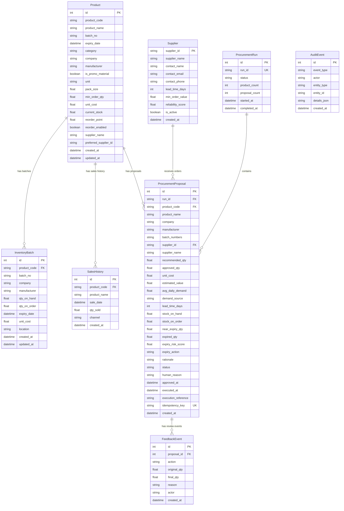
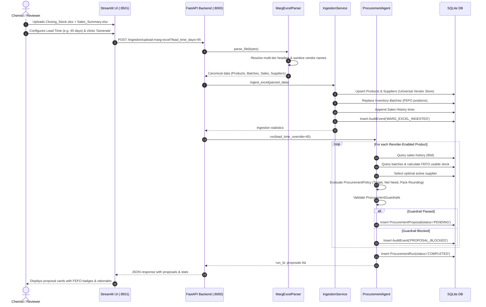
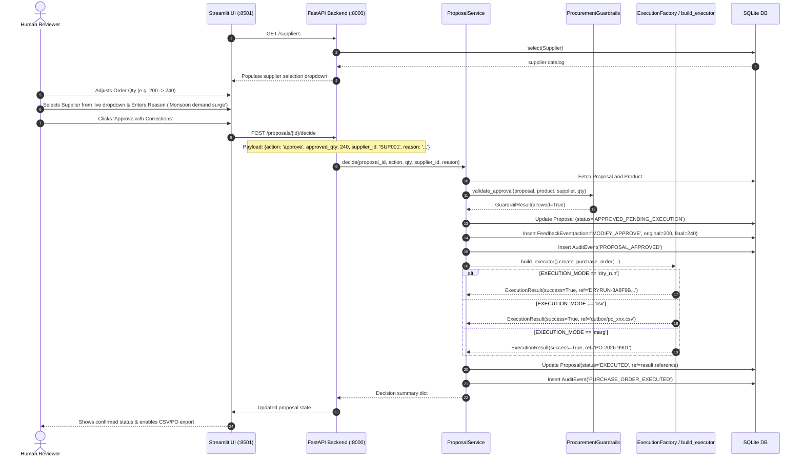
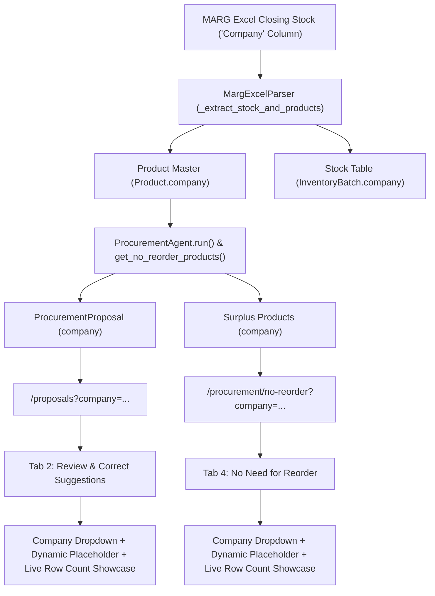
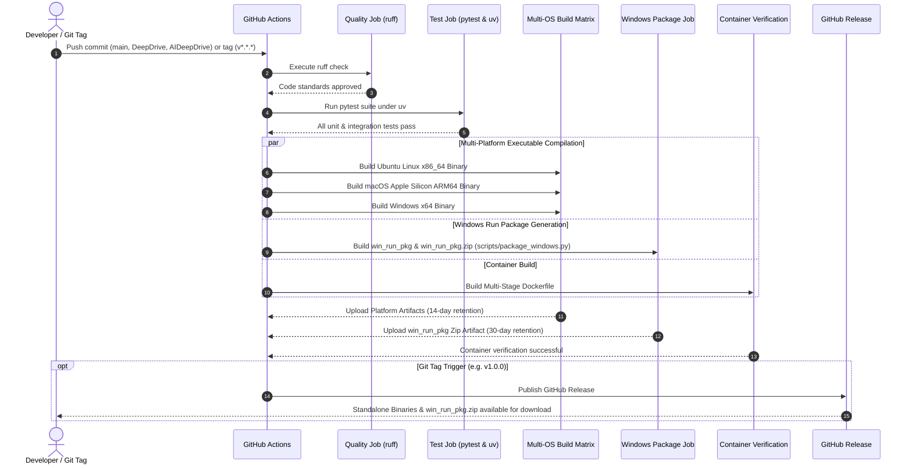

# Low-Level Design (LLD) Document
## MARG Pharmaceutical Procurement Agent (v1.1)

---

### 1. Executive Summary & System Context

The **MARG Pharmaceutical Procurement Agent** is a local-first, human-in-the-loop autonomous procurement system designed for pharmaceutical distributors and retail chemists running **MARG ERP 9+**. 

The system automates the procurement lifecycle by:
1. Ingesting closing stock, FEFO batch expiries, sales histories, and vendor profiles from MARG ERP Excel exports or API interfaces.
2. Computing daily demand velocity ($D$) and applying First-Expiry-First-Out (**FEFO**) inventory positioning.
3. Calculating coverage targets based on configurable lead times (default: **45 days**), review cycles (**7 days**), and safety buffers (**3 days**).
4. Applying deterministic guardrails (quantity caps, value ceilings, pack-size multiples, expiry risk blocks).
5. Enabling human oversight to inspect, modify quantities/suppliers, and approve or reject proposals.
6. Dispatching approved purchase orders through modular execution adapters (Dry-Run simulation, CSV file export, or live MARG ERP REST APIs).
7. Maintaining an immutable compliance audit trail and feedback event history.

```mermaid
flowchart TD
    subgraph Data Source
        M1[MARG ERP 9+ Excel Export] --> P1[MargExcelParser]
        M2[MARG HTTP REST API] --> P2[MargApiSourceAdapter]
    end

    subgraph Normalization & Storage
        P1 --> IS[IngestionService]
        P2 --> IS
        IS --> DB[(SQLite Canonical Store)]
        IS --> PROMO_STORE[(Promo Material Items)]
    end

    subgraph Agent Core Engine
        DB --> DS[DemandService]
        DB --> IV[InventoryService / FEFO]
        DB --> SS[SupplierService]
        DS --> AG[ProcurementAgent]
        IV --> AG
        SS --> AG
        AG --> POL[ProcurementPolicy]
        POL --> GR[ProcurementGuardrails]
        GR --> PROPO[(ProcurementProposal Table)]
    end

    subgraph Human Approval, Revert & Execution
        PROPO --> UI[Streamlit UI / FastAPI Docs]
        PROMO_STORE --> UI
        UI --> PS[ProposalService]
        PS -->|Human Decision & Notes| FE[(FeedbackEvent / Audit)]
        PS -->|Approve & Dispatch| EX[Execution Factory build_executor]
        PS -->|Unapprove / Revert| PROPO
        EX -->|dry_run| DR[DryRunExecutor]
        EX -->|csv| CSV[CsvExecutor -> outbox/]
        EX -->|marg| MHTTP[MargHttpExecutor -> MARG API]
    end
```

---

### 2. Architectural Design & Component Decomposition

The system is organized into modular tiers adhering to Clean Architecture principles:

```
procurement_agent/
├── .github/
│   └── workflows/
│       └── ci-cd.yml          # Automated CI/CD pipeline (Lint, Test, Multi-OS Binary Build, Windows Pkg, Release)
├── backend/
│   ├── app/
│   │   ├── adapters/          # I/O boundaries (Excel parser, order executors, API source)
│   │   │   ├── base.py        # Abstract protocols & execution dataclasses
│   │   │   ├── excel.py       # Robust MARG ERP Excel parsing & template generation
│   │   │   ├── executor.py    # DryRun, CSV, and MARG API PO executors
│   │   │   └── source.py      # Future MARG API read adapters
│   │   ├── agent/             # Autonomous procurement orchestration
│   │   │   └── procurement_agent.py
│   │   ├── core/              # Global configuration & database engine
│   │   │   ├── config.py      # Pydantic Settings loaded from .env
│   │   │   └── database.py    # SQLAlchemy session factory, migrations & directory creation
│   │   ├── models/            # Canonical domain entity models
│   │   │   └── entities.py    # SQLAlchemy Declarative Models
│   │   ├── services/          # Pure domain business logic & guardrails
│   │   │   ├── audit.py       # Regulatory event logging
│   │   │   ├── feedback.py    # Human review, PO dispatch & unapprove service
│   │   │   ├── forecast.py    # Sales history demand forecasting
│   │   │   ├── guardrails.py  # Deterministic financial & pack safety rules
│   │   │   ├── ingestion.py   # Upsert & transaction service for Excel data
│   │   │   ├── inventory.py   # FEFO expiry & inventory position aggregator
│   │   │   ├── policy.py      # Mathematical reorder & buffer calculator
│   │   │   └── supplier.py    # Multi-criteria vendor selection algorithm
│   │   └── main.py            # FastAPI REST API controller & routing
│   └── tests/                 # Unit & integration test suites
│       └── test_marg_ingestion.py
├── frontend/
│   └── streamlit_app.py       # Interactive Streamlit Human-in-the-Loop Web UI (8 Tabs)
├── scripts/
│   ├── generate_demo_data.py  # Synthetic pharmaceutical dataset seeder
│   ├── build_executable.py    # Standalone binary compilation script (PyInstaller)
│   └── package_windows.py     # Windows distribution package builder (win_run_pkg.zip)
├── Dockerfile                 # Multi-stage production container build (astral-sh/uv)
├── docker-compose.yml         # Container stack with persistent SQLite storage volume
├── .dockerignore              # Docker build exclusions
├── launcher.py                # Unified process orchestrator (FastAPI + Streamlit + health polling)
├── run_mac.command            # One-click desktop launcher for macOS (double-clickable)
├── run_windows.bat            # One-click desktop launcher for Windows (3-tier auto-installer)
├── run_windows_isolated.bat   # Isolated runner for Windows environments
├── package_windows.bat        # Convenience batch script to build win_run_pkg.zip
├── win_run_pkg/               # Portable standalone Windows package directory
├── WINDOWS_RUN_GUIDE.md       # Comprehensive Windows deployment & troubleshooting guide
├── pyproject.toml             # Modern Python project specification (PEP 621) & tool configurations
├── uv.lock                    # Deterministic cross-platform dependency lockfile
├── requirements.txt           # Legacy pip fallback specification
└── .env
```


---

### 3. Canonical Domain Entity Models & Database Schema

The database is built on **SQLite** using **SQLAlchemy 2.0 Declarative Mapped Models**.


```mermaid
erDiagram
    Product ||--o{ InventoryBatch : "has batches"
    Product ||--o{ SalesHistory : "has sales history"
    Product ||--o{ ProcurementProposal : "has proposals"
    Supplier ||--o{ ProcurementProposal : "receives orders"
    ProcurementProposal ||--o{ FeedbackEvent : "has review events"
    ProcurementRun ||--o{ ProcurementProposal : "contains"

    Product {
        int id PK
        string product_code
        string product_name
        string batch_no
        datetime expiry_date
        string category
        string company
        string manufacturer
        boolean is_promo_material
        string unit
        float pack_size
        float min_order_qty
        float unit_cost
        float current_stock
        float reorder_point
        boolean reorder_enabled
        string supplier_name
        string preferred_supplier_id
        datetime created_at
        datetime updated_at
    }

    Supplier {
        string supplier_id PK
        string supplier_name
        string contact_name
        string contact_email
        string contact_phone
        int lead_time_days
        float min_order_value
        float reliability_score
        boolean is_active
        datetime created_at
    }

    InventoryBatch {
        int id PK
        string product_code FK
        string batch_no
        string company
        string manufacturer
        float qty_on_hand
        float qty_on_order
        datetime expiry_date
        float unit_cost
        string location
        datetime created_at
        datetime updated_at
    }

    SalesHistory {
        int id PK
        string product_code FK
        string product_name
        datetime sale_date
        float qty_sold
        string channel
        datetime created_at
    }

    ProcurementRun {
        int id PK
        string run_id UK
        string status
        int product_count
        int proposal_count
        datetime started_at
        datetime completed_at
    }

    ProcurementProposal {
        int id PK
        string run_id FK
        string product_code FK
        string product_name
        string company
        string manufacturer
        string batch_numbers
        string supplier_id FK
        string supplier_name
        float recommended_qty
        float approved_qty
        float unit_cost
        float estimated_value
        float avg_daily_demand
        string demand_source
        int lead_time_days
        float stock_on_hand
        float stock_on_order
        float near_expiry_qty
        float expired_qty
        float expiry_risk_score
        string expiry_action
        string rationale
        string status
        string human_reason
        datetime approved_at
        datetime executed_at
        string execution_reference
        string idempotency_key UK
        datetime created_at
    }

    FeedbackEvent {
        int id PK
        int proposal_id FK
        string action
        float original_qty
        float final_qty
        string reason
        string actor
        datetime created_at
    }

    AuditEvent {
        int id PK
        string event_type
        string actor
        string entity_type
        string entity_id
        string details_json
        datetime created_at
    }
```

---

### 4. Mathematical Modeling & Algorithmic Specifications

#### 4.1 Daily Demand Velocity (`DemandService`)

The Daily Demand Velocity ($D$) is computed as the total quantity sold from 1st April of the current financial year to today, divided by the elapsed days:

$$D = \frac{\text{Total Quantity Sale}}{\text{Days from 1st April to Today}}$$

Where:
$$\text{Days from 1st April to Today} = \max(1, (\text{today} - \text{date}(\text{FY Year}, 4, 1)).\text{days})$$

**Sales Matching Hierarchy:**
1. **Direct SKU Code Match**: Matches `SalesHistory.product_code == product_code` (for exports preserving ERP item codes).
2. **Exact Product Name Match**: Matches `func.upper(SalesHistory.product_name) == clean_name` (ensuring sales reports exported without internal item codes match stock rows with 100% precision).
3. **Canonical Formulation Key Match**: Matches across formulations sharing the same active ingredients and dosage form family using `pharma_canonical_key(product_name)` (capturing multi-pack variants like `10X1X10` vs `10X10`).
4. **Heuristic Fallbacks**: If no sales history exists across the financial year:
   a. If a MARG Reorder Level ($RL > 0$) is configured, demand is estimated assuming a 30-day baseline consumption:
      $$D = \frac{RL}{30}$$
   b. If the product is completely out of stock ($S_{\text{on\_hand}} \le 0$) with reorder enabled, a stockout replenishment baseline is provided:
      $$D = \frac{\max(1.0, MOQ, P)}{30}$$
   c. Otherwise, $D = 0.0$ (`no_history`).

---

#### 4.2 FEFO Inventory Position & Expiry Risk (`InventoryService`)

Let $B$ be the set of inventory batches for product $p$:
- **Expired Stock ($S_{\text{expired}}$)**: Batches where $\text{expiry\_date} \le \text{today}$.
- **Near-Expiry Stock ($S_{\text{near}}$)**: Batches where $\text{today} < \text{expiry\_date} \le \text{today} + 90\text{ days}$.
- **Usable Stock ($S_{\text{usable}}$)**:
  $$S_{\text{usable}} = \max\left(0, (S_{\text{on\_hand}} - S_{\text{expired}}) - S_{\text{near}}\right)$$

**Expiry Risk Ratio ($R_{\text{exp}}$):**
$$R_{\text{exp}} = \begin{cases} 
\frac{S_{\text{near}}}{S_{\text{on\_hand}}} & \text{if } S_{\text{on\_hand}} > 0 \\
0 & \text{otherwise}
\end{cases}$$

**Expiry Action Policy ($M$ = Demand Multiplier):**
- If $R_{\text{exp}} \ge 0.50 \implies \text{Action} = \mathbf{PAUSE\_PROCUREMENT},\; M = 0.0$
- If $0.25 \le R_{\text{exp}} < 0.50 \implies \text{Action} = \mathbf{REDUCE\_ORDER},\; M = 0.5$
- If $R_{\text{exp}} < 0.25 \implies \text{Action} = \mathbf{NORMAL},\; M = 1.0$

---

#### 4.3 Target Stock & Reorder Policy (`ProcurementPolicy`)

Let:
- $L$ = Supplier Lead Time in days (Default: **45 days**, configurable).
- $R$ = Review Cycle in days (Default: **7 days**).
- $S$ = Safety Buffer in days (Default: **3 days**).

$$\text{Coverage Days} = L + R + S$$
$$\text{Target Stock} = D \times M \times \text{Coverage Days}$$
$$\text{Net Need} = \text{Target Stock} - S_{\text{usable}} - S_{\text{on\_order}}$$

If $\text{Net Need} < 0 \implies \text{Order Qty} = 0$ (Surplus stock covers target; routed strictly to **No Need for Reorder** catalog).

If $\text{Net Need} = 0$, usable stock is at the exact reorder threshold or represents an out-of-stock item with zero buffer. To allow human verification, the agent suggests a baseline order of 1 pack multiple ($P$) or $MOQ$ and routes the item to **Review & Correct Suggestions**:

$$\text{Order Qty}_{\text{Net Need}=0} = \max(P,\; \lceil MOQ / P \rceil \times P)$$

If $\text{Net Need} > 0$, order quantity is rounded up to the integer pack multiple ($P$) and constrained by Minimum Order Quantity ($MOQ$), routed to **Review & Correct Suggestions**:

$$\text{Packs} = \left\lceil \frac{\text{Net Need}}{P} \right\rceil$$
$$\text{Order Qty} = \max(\text{Packs} \times P,\; \lceil MOQ / P \rceil \times P)$$
$$\text{Estimated Value} = \text{Order Qty} \times \text{Unit Cost}$$

---

#### 4.4 Deterministic Guardrails (`ProcurementGuardrails`)

Every proposal must pass 7 deterministic checks before being emitted:

| Rule | Threshold / Constraint | Enforcement Level |
|---|---|---|
| **Quantity Positive** | $\text{Qty} > 0$ | Hard Block |
| **Max Quantity Hard Cap** | $\text{Qty} \le 5,000\text{ units}$ (Configurable) | Hard Block |
| **Max Value Budget Cap** | $\text{Value} \le ₹250,000$ (Configurable) | Hard Block |
| **Product Enabled** | $\text{Product.reorder\_enabled} == \text{True}$ | Hard Block |
| **Active Supplier** | $\text{Supplier.is\_active} == \text{True}$ | Hard Block |
| **Pack Multiplicity** | $\text{Qty} \pmod{\text{Pack Size}} == 0$ | Hard Block |
| **High Expiry Review Block**| $R_{\text{exp}} \ge 0.50 \implies \text{Blocked if Qty} > 0$ | Hard Block |
| **Supplier Minimum Value** | $\text{Value} < \text{Supplier.min\_order\_value}$ | Informational Warning |

---

#### 4.5 Multi-Tier Header Resolution & Ingestion Sanitization (`backend/app/adapters/excel.py`)

Pharmaceutical enterprise exports from MARG ERP 9+ typically contain non-standard header formats, such as multi-row titles, date-stamped column names, arbitrary metadata lines, and promotional non-pharmaceutical items. The ingestion engine executes a robust three-stage normalization pipeline:

1. **Heuristic Header Scoring (`_resolve_headers_and_data`)**:
   - Scans rows 0 through 15 looking for domain keywords: `['item', 'description', 'particulars', 'stock', 'qty', 'rate', 'mrp', 'batch', 'exp', 'company', 'supplier']`.
   - Scores each candidate row based on keyword presence and non-null cell density.
   - Detects sub-header splits (e.g., Row 1 containing category, Row 2 containing field names) and merges them to form unambiguous column identities.

2. **Supplier Name Sanitization & Date-Prefix Stripping (`sanitize_supplier_name`)**:
   - Removes date-stamps, invoice prefixes, or timestamps prepended to vendor names (e.g. converting `"12/03/2026 ABC PHARMA LTD"` or `"12-03-26 - CADILA HEALTHCARE"` to clean canonical names like `"ABC PHARMA LTD"` and `"CADILA HEALTHCARE"`).
   - Strips non-printable characters, unifies case, and collapses repeated whitespace.

3. **Universal Supplier Upsert**:
   - Any valid supplier extracted during sheet processing is deduplicated and upserted into the persistent `suppliers` table with default active status (`is_active = True`) and assigned lead times.
   - Ensures that all vendor records from uploaded spreadsheets immediately populate the live human-in-the-loop review dropdowns.

4. **Promotional Material Tagging & Isolation (`is_promotional_material`)**:
   - Rather than discarding non-pharmaceutical items, the ingestion engine identifies promotional and packaging materials via:
     1. Product name keywords: `['BAG', 'DIARY', 'SHIRT', 'CALENDER', 'CALENDAR', 'FOIL', 'BOX', 'PLAT CHARGES', 'PRODUCT', 'VISUAL-AID', 'PACKING', 'PEN-', 'PILLOW']`.
     2. Rows where both manufacturer and supplier fields are blank in the source export.
   - Identified records are ingested into the database with `is_promo_material = True`, `reorder_enabled = False`, and category `'Promo Material'`.
   - Isolating promotional items ensures 100% auditability and inventory visibility via the dedicated **🎁 Promo Material** UI tab and `GET /promo-material` API, while completely preventing spurious reorder proposals, inaccurate demand velocities, or zero-reorder surplus contamination.

---

#### 4.6 High-Performance Zero-Reorder Analysis & Pre-Fetching (`/procurement/no-reorder`)

To support warehouse inventory audits without performance degradation or UI timeouts:

1. **O(1) Batch Pre-Fetching Architecture**:
   - Rather than querying inventory batches and sales transactions iteratively per product ($N+1$ query hazard), `get_no_reorder_products()` performs **3 bulk queries**:
     1. All reorder-enabled `Product` entities.
     2. All `InventoryBatch` records grouped in-memory by `product_code`.
     3. All `SalesHistory` records grouped in-memory by `product_code`.
   - Reconstructs FEFO usable positions ($S_{\text{usable}}$) and daily demand velocity ($D$) entirely in RAM, completing across thousands of items in **< 35ms**.

2. **Surplus Evaluation (`Net Need < 0`)**:
   - Identifies items where:
     $$\text{Net Need} = \text{Target Stock} - S_{\text{usable}} - S_{\text{on\_order}} < 0$$
   - Items where $\text{Net Need} = 0$ (at exact coverage boundary or zero stock) are routed to **Review & Correct Suggestions** to enable pharmacist review.
   - Orders all qualified products alphabetically by character (`product_name.asc()`).
   - Supports instant substring search filtering across product codes and descriptions.

3. **Strict Tab Isolation between Covered Healthy Inventory and Inventory & FEFO**:
   - Products qualifying for the 'No Need for Reorder' catalog must have healthy covered stock (`Net Need < 0` and `expiry_action != 'PAUSE_PROCUREMENT'`). Items whose procurement was paused due to critical expiry risk are routed to the Inventory & FEFO tab.
   - Any product that is in a healthy state in the 'No Need for Reorder' catalog is **strictly excluded from appearing in the 'Inventory and FEFO' tab** (`GET /inventory?exclude_healthy=true`). This guarantees zero cross-tab redundancy between covered healthy inventory and at-risk stock requiring expiry action.

---

### 5. Sequence Workflows

#### 5.1 End-to-End Ingestion & Procurement Generation


```mermaid
sequenceDiagram
    autonumber
    actor User as Chemist / Reviewer
    participant UI as Streamlit UI (:8501)
    participant API as FastAPI Backend (:8000)
    participant Parser as MargExcelParser
    participant Svc as IngestionService
    participant Agent as ProcurementAgent
    participant DB as SQLite DB

    User->>UI: Uploads Closing_Stock.xlsx + Sales_Summary.xlsx
    User->>UI: Configures Lead Time (e.g. 45 days) & clicks 'Generate'
    UI->>API: POST /ingestion/upload-marg-excel?lead_time_days=45
    API->>Parser: parse_file(bytes)
    Parser->>Parser: Resolve multi-tier headers & sanitize vendor names
    Parser-->>API: Canonical data (Products, Batches, Sales, Suppliers)
    API->>Svc: ingest_excel(parsed_data)
    Svc->>DB: Upsert Products & Suppliers (Universal Vendor Store)
    Svc->>DB: Replace Inventory Batches (FEFO positions)
    Svc->>DB: Append Sales History lines
    Svc->>DB: Insert AuditEvent('MARG_EXCEL_INGESTED')
    Svc-->>API: Ingestion statistics

    API->>Agent: run(lead_time_override=45)
    loop For each Reorder-Enabled Product
        Agent->>DB: Query sales history (90d)
        Agent->>DB: Query batches & calculate FEFO usable stock
        Agent->>DB: Select optimal active supplier
        Agent->>Agent: Evaluate ProcurementPolicy (Target, Net Need, Pack Rounding)
        Agent->>Agent: Validate ProcurementGuardrails
        alt Guardrail Passed
            Agent->>DB: Insert ProcurementProposal(status='PENDING')
        else Guardrail Blocked
            Agent->>DB: Insert AuditEvent('PROPOSAL_BLOCKED')
        end
    end
    Agent->>DB: Insert ProcurementRun(status='COMPLETED')
    Agent-->>API: run_id, proposals list
    API-->>UI: JSON response with proposals & stats
    UI-->>User: Displays proposal cards with FEFO badges & rationales
```

#### 5.2 Human Correction & Purchase Order Execution


```mermaid
sequenceDiagram
    autonumber
    actor User as Human Reviewer
    participant UI as Streamlit UI (:8501)
    participant API as FastAPI Backend (:8000)
    participant Svc as ProposalService
    participant Guard as ProcurementGuardrails
    participant Exec as ExecutionFactory / build_executor
    participant DB as SQLite DB

    UI->>API: GET /suppliers
    API->>DB: select(Supplier)
    DB-->>API: supplier catalog
    API-->>UI: Populate supplier selection dropdown

    User->>UI: Adjusts Order Qty (e.g. 200 -> 240)
    User->>UI: Selects Supplier from live dropdown & Enters Reason ('Monsoon demand surge')
    User->>UI: Clicks 'Approve with Corrections'
    UI->>API: POST /proposals/{id}/decide
    Note over API: Payload: {action: 'approve', approved_qty: 240, supplier_id: 'SUP001', reason: '...'}
    API->>Svc: decide(proposal_id, action, qty, supplier_id, reason)
    Svc->>DB: Fetch Proposal and Product
    Svc->>Guard: validate_approval(proposal, product, supplier, qty)
    Guard-->>Svc: GuardrailResult(allowed=True)
    Svc->>DB: Update Proposal (status='APPROVED_PENDING_EXECUTION')
    Svc->>DB: Insert FeedbackEvent(action='MODIFY_APPROVE', original=200, final=240)
    Svc->>DB: Insert AuditEvent('PROPOSAL_APPROVED')
    
    Svc->>Exec: build_executor().create_purchase_order(...)
    alt EXECUTION_MODE == 'dry_run'
        Exec-->>Svc: ExecutionResult(success=True, ref='DRYRUN-3A8F9B...')
    else EXECUTION_MODE == 'csv'
        Exec-->>Svc: ExecutionResult(success=True, ref='outbox/po_xxx.csv')
    else EXECUTION_MODE == 'marg'
        Exec-->>Svc: ExecutionResult(success=True, ref='PO-2026-9901')
    end

    Svc->>DB: Update Proposal(status='EXECUTED', ref=result.reference)
    Svc->>DB: Insert AuditEvent('PURCHASE_ORDER_EXECUTED')
    Svc-->>API: Decision summary dict
    API-->>UI: Updated proposal state
    UI-->>User: Shows confirmed status & enables CSV/PO export
```

#### 5.3 Proposal Revert / Unapprove Workflow (Return to Review)

To prevent erroneous purchase orders from proceeding without recourse, reviewers can remove items from **Tab 3: Approved Orders** and return them to **Tab 2: Review & Correct Suggestions**:

```mermaid
sequenceDiagram
    autonumber
    actor User as Human Reviewer
    participant UI as Streamlit UI (Tab 3: Approved Orders)
    participant API as FastAPI Backend (:8000)
    participant Svc as ProposalService
    participant DB as SQLite DB

    User->>UI: Selects item(s) from "Remove Items from Approved Orders" or clicks "🗑️ Remove Item"
    UI->>API: POST /proposals/{id}/unapprove (Payload: {action: 'unapprove', reason: '...', actor: 'human-reviewer'})
    API->>Svc: decide(proposal_id, action="unapprove", reason, actor)
    Svc->>DB: Fetch Proposal (verifies status in APPROVED_PENDING_EXECUTION, EXECUTED, REJECTED)
    Svc->>DB: Reset proposal.status = 'PENDING', approved_qty = None, execution_reference = None
    Svc->>DB: Insert FeedbackEvent(action='REVERT_TO_PENDING', reason='...')
    Svc->>DB: Insert AuditEvent('PROPOSAL_REVERTED_TO_PENDING')
    Svc-->>API: {"status": "PENDING", "message": "Proposal #id returned to PENDING review."}
    API-->>UI: Success confirmation
    UI->>UI: Refreshes view; item disappears from Approved Orders and reappears in Review Suggestions
```

---

#### 5.4 Company Attribution & Multi-Tab Filter Workflow

Pharmaceutical distributors organize catalogs and replenishment cycles primarily by manufacturing company (e.g. *Apex Pharma*, *Cipla Ltd*, *Sun Pharma*, *Dr Reddys*). The company dimension is ingested and propagated through all tiers:


```mermaid
flowchart TD
    RAW["MARG Excel Closing Stock ('Company' Column)"] --> PARSE["MargExcelParser (_extract_stock_and_products)"]
    PARSE --> PROD["Product Master (Product.company)"]
    PARSE --> STK["Stock Table (InventoryBatch.company)"]
    PROD --> AGENT["ProcurementAgent.run() & get_no_reorder_products()"]
    AGENT --> PROP["ProcurementProposal (company)"]
    AGENT --> SURPLUS["Surplus Products (company)"]
    PROP --> API1["/proposals?company=..."]
    SURPLUS --> API2["/procurement/no-reorder?company=..."]
    API1 --> TAB2["Tab 2: Review & Correct Suggestions"]
    API2 --> TAB4["Tab 4: No Need for Reorder"]
    TAB2 --> SHOWCASE2["Company Dropdown + Dynamic Placeholder + Live Row Count Showcase"]
    TAB4 --> SHOWCASE4["Company Dropdown + Dynamic Placeholder + Live Row Count Showcase"]
```

1. **Ingestion & Auto-Migration**:
   - `MargExcelParser` normalizes column variations (`Company`, `COMPANY`, `C O M P A N Y`, `Company Name`) to canonical `company`.
   - `init_db()` in `backend/app/core/database.py` executes an automatic SQLite `PRAGMA table_info` migration, adding `company VARCHAR(256)` to existing `products`, `inventory_batches`, and `procurement_proposals` tables without requiring manual schema drops.
2. **Multi-Tab Filtering & Row Count Showcases**:
   - **Tab 2 (Review & Correct Suggestions)** and **Tab 4 (No Need for Reorder)** provide an interactive **🏢 Filter by Company** selectbox.
   - Each dropdown entry displays row counts per manufacturer (e.g. `Cipla Ltd (8 rows)`).
   - Dynamic search input placeholders display current row count and company scope: `Search within {N} rows for {Company}...`.
   - Live information callouts highlight exact row counts displayed in the tab: `Showing {N} row(s) (Filtered by Company: {Company})`.
   - Warning empty-state placeholders display when no items match: `No rows found for company '{Company}' (0 rows displayed)`.
   - Dataframe summary tables and item cards feature dedicated Company columns and badges (`🏢 Company`).

---

#### 5.5 Stateful Tab Persistence & URL Deep-Linking

To eliminate tab-resetting (where any button action or browser refresh defaulted the UI back to Tab 1), the presentation layer implements bidirectional state persistence:

1. **Stateful `st.tabs`**:
   - `st.tabs` is configured with `key="main_active_tab"` and `on_change=on_main_tab_changed`.
   - Uses clean, immutable tab identifiers, preventing Streamlit from destroying and recreating tab widgets on data updates.
2. **Bidirectional URL Query Parameter Sync (`st.query_params`)**:
   - Mapped 8 URL slugs (`upload`, `proposals`, `approved`, `no_reorder`, `inventory`, `promo_material`, `audit`, `logs`) to their respective tab containers.
   - When a user refreshes the browser (`F5` or `Cmd+R`), the browser URL query parameter `?tab=<slug>` is read first to reconstruct the active tab in `st.session_state["main_active_tab"]`.
   - User actions triggering `st.rerun()` (such as *Refresh Data*, *Approve with Corrections*, *Reject*, *Remove Item*, *Reset Search*, *Show All Products*, and pagination) maintain the active tab without state loss.
   - Direct tab-switching buttons update `st.session_state["main_active_tab"]` and `st.query_params["tab"]` before dispatching `st.rerun()`.

---

### 6. Interface & REST API Contracts

| Method | Endpoint | Description | Request Body / Query | Response Model |
|---|---|---|---|---|
| `GET` | `/health` | System health & execution mode | None | `{"status": "ok", "app": "...", "mode": "..."}` |
| `GET` | `/products` | List all canonical products | None | `list[ProductDict]` |
| `GET` | `/products/{code}` | Get single product by code | None | `ProductDict` |
| `GET` | `/suppliers` | List all active vendors | None | `list[SupplierDict]` |
| `GET` | `/inventory` | List all current batch positions, company & expiries | None | `list[InventoryBatchDict]` |
| `GET` | `/promo-material` | List promotional and packaging supplies isolated from drug reorders | `?company=...&search=...` | `list[PromoMaterialDict]` |
| `POST` | `/runs` | Trigger procurement agent execution | `{"product_codes": [], "lead_time_days": 45}` | `{"run_id": "...", "proposals": N}` |
| `GET` | `/runs` | List historical agent execution runs | None | `list[RunDict]` |
| `GET` | `/proposals` | Query generated proposals (status & company filtered) | `?status_filter=PENDING&company=Cipla+Ltd` | `list[ProposalDict]` |
| `GET` | `/proposals/{id}` | Get single proposal details | None | `ProposalDict` |
| `POST` | `/proposals/{id}/decide` | Approve/modify/reject a proposal | `{"action": "approve", "approved_qty": 100, ...}` | `{"status": "EXECUTED", "reference": "..."}` |
| `POST` | `/proposals/{id}/unapprove` | Revert an approved/executed proposal back to PENDING review | `{"reason": "...", "actor": "human-reviewer"}` | `{"status": "PENDING", "message": "..."}` |
| `POST` | `/proposals/batch-decide` | Batch approve, reject, or revert proposals | `{"action": "approve"\|"reject"\|"unapprove", "proposal_ids": [...]}` | `{"status": "success", "processed": N}` |
| `GET` | `/procurement/no-reorder` | Products with Net Need < 0 (fast pre-fetch, company filtered) | `?lead_time_days=45&search=...&company=...` | `list[NoReorderProductDict]` |
| `POST` | `/ingestion/upload-marg-excel` | Multipart file upload for MARG Excel | `file: bytes, run_agent: bool, lead_time_days: int` | `{"stats": {...}, "proposals": [...]}` |
| `GET` | `/ingestion/sample-template` | Download verified sample MARG Excel workbook | None | `application/vnd.openxmlformats` binary |
| `POST` | `/system/reset-db` | Purge database records for fresh ingestion | None | `{"status": "success", "purged": {...}}` |
| `GET` | `/system/logs` | Fetch live application runtime logs | `?lines=100` | `{"lines": [...], "total_lines": N}` |
| `GET` | `/audit` | Retrieve regulatory audit event logs | `?limit=100` | `list[AuditEventDict]` |

> [!NOTE]
> **SQLite Database Directory Auto-Creation**: `backend/app/core/database.py` automatically checks and creates parent directory trees for custom SQLite database paths (e.g. `./data/procurement_agent.db`), eliminating startup failure risks in container or isolated directory setups.

---

### 7. Reliability, Idempotency & Security Design

1. **Idempotency Keys**:
   Every proposal generates an immutable SHA-256 hash idempotency key:
   $$\text{Key} = \text{SHA256}(\text{run\_id} \,\|\, \text{product\_code} \,\|\, \text{supplier\_id} \,\|\, \text{order\_qty})$$
   This guarantees that accidental retries or duplicate approval submissions cannot trigger duplicate purchase orders.

2. **Database Concurrency & Transaction Boundaries**:
   SQLite is configured with `check_same_thread=False` and transactional session boundaries (`get_db` FastAPI dependency) to prevent thread locking during background agent execution.

3. **Safe Defaults**:
   By default, `EXECUTION_MODE=dry_run` and `REQUIRE_HUMAN_APPROVAL=true`. External API credentials and live MARG connectors cannot execute orders without explicit human approval and policy configuration.

---

### 8. Verification & Test Plan

- **Unit Testing**:
  - `MargExcelParser`: Validates header detection, column alias mapping, and date/expiry string parsing (`MM/YY`, `MM-YYYY`, `ISO`).
  - `ProcurementPolicy`: Validates coverage mathematics, buffer summation, pack-size ceiling rounding, and MOQ enforcement.
  - `ProcurementGuardrails`: Validates hard ceiling rejections, non-pack quantity blocks, and 50% expiry risk lockouts.
- **Integration Testing**:
  - Ingestion $\rightarrow$ Agent Run $\rightarrow$ Proposal Creation $\rightarrow$ Human Decision $\rightarrow$ DryRun/CSV Executor output.

---

### 9. Packaging, Containerization & CI/CD Architecture

#### 9.1 Unified Process Orchestration (`launcher.py`)
To enable single-command local execution and standalone binary compilation without requiring users to maintain two distinct terminal sessions, `launcher.py` acts as a supervisory parent process:
1. **Asynchronous Initialization**: Spawns the FastAPI backend (`backend.app.main:app`) as a child subprocess on `127.0.0.1:8000`.
2. **Health Probe**: Polls `GET /health` with a 20-second timeout until the API service reports readiness.
3. **Frontend Launch**: Spawns the Streamlit UI as a sibling subprocess on `localhost:8501`.
4. **Signal Propagation & Teardown**: Hooks operating system signals (`SIGINT`, `SIGTERM`) to guarantee dual-process graceful termination, preventing leaked socket bindings on ports 8000 and 8501.

#### 9.2 Standalone Binary Executable Packaging (`PyInstaller`)
Implemented in `scripts/build_executable.py`, the application can be frozen into a self-contained binary distribution:
* **Architecture**: Standalone directory package (`--onedir`) bundling the Python 3.12 CPython interpreter, C-extensions, FastAPI ASGI stack, SQLAlchemy SQLite dialect, and full Streamlit web assets (`static/`, frontend templates).
* **Target Platforms**: Cross-compiled natively across **Linux (x86_64)**, **macOS (Apple Silicon arm64)**, and **Windows (x64)**.
* **Zero Dependency Footprint**: Enables client distribution to pharmaceutical warehouse workstations without pre-existing Python runtimes or network access.

#### 9.3 Production Multi-Stage Containerization (`Dockerfile`)
The Docker container adheres to minimal attack-surface and deterministic build standards:
* **Builder Stage**: Uses `ghcr.io/astral-sh/uv:python3.12-bookworm-slim` to resolve `pyproject.toml` and `uv.lock` with bytecode pre-compilation (`UV_COMPILE_BYTECODE=1`).
* **Runtime Stage**: Uses `python:3.12-slim-bookworm`, copying only the pre-built virtual environment (`/app/.venv`) and application source code, omitting compilers, package managers, and development headers.
* **Health Probes**: Integrated Docker container `HEALTHCHECK` querying `/health` at 30-second intervals.

#### 9.4 Industry-Standard CI/CD Specification (`.github/workflows/ci-cd.yml`)
The GitHub Actions workflow automates quality enforcement, cross-platform packaging, and artifact distribution:


```mermaid
sequenceDiagram
    autonumber
    actor Dev as Developer / Git Tag
    participant GHA as GitHub Actions
    participant QA as Quality Job (ruff)
    participant Test as Test Job (pytest & uv)
    participant Matrix as Multi-OS Build Matrix
    participant WinPkg as Windows Package Job
    participant Docker as Container Verification
    participant Rel as GitHub Release

    Dev->>GHA: Push commit (main, DeepDrive, AIDeepDrive) or tag (v*.*.*)
    GHA->>QA: Execute ruff check
    QA-->>GHA: Code standards approved
    GHA->>Test: Run pytest suite under uv
    Test-->>GHA: All unit & integration tests pass
    
    par Multi-Platform Executable Compilation
        GHA->>Matrix: Build Ubuntu Linux x86_64 Binary
        GHA->>Matrix: Build macOS Apple Silicon ARM64 Binary
        GHA->>Matrix: Build Windows x64 Binary
    and Windows Run Package Generation
        GHA->>WinPkg: Build win_run_pkg & win_run_pkg.zip (scripts/package_windows.py)
    and Container Build
        GHA->>Docker: Build Multi-Stage Dockerfile
    end
    
    Matrix-->>GHA: Upload Platform Artifacts (14-day retention)
    WinPkg-->>GHA: Upload win_run_pkg Zip Artifact (30-day retention)
    Docker-->>GHA: Container verification successful

    opt Git Tag Trigger (e.g. v1.0.0)
        GHA->>Rel: Publish GitHub Release
        Rel-->>Dev: Standalone Binaries & win_run_pkg.zip available for download
    end
```

| Pipeline Job | Environment | Tooling & Target | Artifact Produced |
|---|---|---|---|
| `quality` | `ubuntu-latest` | `ruff check` | Code style verification |
| `test` | `ubuntu-latest` | `astral-sh/setup-uv@v5`, `pytest` | Test execution report |
| `build-executable` (Linux) | `ubuntu-latest` | `PyInstaller` | `procurement-agent-linux-x86_64.tar.gz` |
| `build-executable` (macOS) | `macos-latest` | `PyInstaller` | `procurement-agent-macos-arm64.tar.gz` |
| `build-executable` (Windows) | `windows-latest` | `PyInstaller` | `procurement-agent-windows-x64.zip` |
| `build-win-pkg` | `ubuntu-latest` | `python scripts/package_windows.py` | `win_run_pkg.zip` |
| `docker-build` | `ubuntu-latest` | `docker/setup-buildx-action@v3` | Verified Docker image cache |
| `release` | `ubuntu-latest` | `softprops/action-gh-release@v2` | Official GitHub Release with executables & win_run_pkg.zip |

#### 9.5 One-Click Native Desktop Launchers & Windows Run Package

To ensure non-technical warehouse supervisors and retail pharmacy operators can start the application without command-line setup:

1. **macOS Launcher (`run_mac.command`)**:
   - Native double-clickable terminal script.
   - Automatically resolves working directory: `cd "$(dirname "$0")"`.
   - Probes runtime environment (evaluating `uv run`, virtual environment `.venv`, and system Python 3.10+).
   - Automatically installs required dependencies into `.venv` if missing.
   - Launches `launcher.py`, which brings up FastAPI (:8000), checks health readiness, and opens `http://localhost:8501`.

2. **Windows Launcher (`run_windows.bat`) — 3-Tier Zero-Config Strategy**:
   - Native double-clickable Windows command batch file.
   - **Strategy 1 (Astral uv)**: Detects `uv` in `PATH`, `%USERPROFILE%\.local\bin`, or `%USERPROFILE%\.cargo\bin`. If found, performs instant dependency synchronization (`uv sync`) and launches the app.
   - **Strategy 2 (System Python / Windows Python Launcher)**: Detects Python 3.10+ via `python` or official Windows launcher `py -3`. Creates `.venv` and installs dependencies from `requirements.txt`.
   - **Strategy 3 (Automated Zero-Config Non-Admin Bootstrap)**: If neither Python nor uv is installed, automatically downloads and configures lightweight `uv` via PowerShell (`irm https://astral.sh/uv/install.ps1 | iex`) without requiring administrator privileges, ensuring seamless zero-setup execution.

3. **Portable Windows Run Package & Isolated Runner (`win_run_pkg`, `run_windows_isolated.bat`)**:
   - Generated by `scripts/package_windows.py` (or `package_windows.bat`).
   - Produces a self-contained portable distribution folder `win_run_pkg/` and compressed archive `win_run_pkg.zip`.
   - Includes `run_isolated.bat` pre-configured to execute in an isolated runtime environment.
   - Full setup and troubleshooting documentation provided in `WINDOWS_RUN_GUIDE.md`.

#### 9.6 Multi-Container Orchestration (`docker-compose.yml`)

For teams standardizing on Docker deployments, `docker-compose.yml` provides a production-ready container stack:
* **Single Command Launch**: `docker compose up --build`.
* **Persistent Storage Volume**: Mounts named volume `procurement_data` to `/data`, storing `procurement_agent.db` safely across container rebuilds and restarts.
* **Dual Port Mapping**: Exposes FastAPI on `:8000` (API & Swagger docs) and Streamlit on `:8501`.
* **Container Healthcheck**: Automatic HTTP healthcheck querying `/health` at 30-second intervals with 15-second startup grace period.
* **Configurable Defaults**: Environment variables pre-configured for dry-run safety (`EXECUTION_MODE=dry_run`, `REQUIRE_HUMAN_APPROVAL=true`, `DEFAULT_LEAD_TIME_DAYS=45`).

---

### 10. Revision History & Known Fixes

* **v1.2 (Current)**:
  * **Proposal Revert / Unapprove Workflow**: Added `POST /proposals/{proposal_id}/unapprove` and batch revert capability in `ProposalService`, allowing human reviewers to remove approved items from Tab 3 and automatically return them to Tab 2 for quantity corrections or re-evaluation, with full audit trail logging (`PROPOSAL_REVERTED_TO_PENDING`).
  * **Promotional Material Ingestion & Segregation**: Implemented `is_promotional_material` detection for stationery, gift items, and non-medicine inventory (blank manufacturer & supplier). Added `is_promo_material` database flag, excluded promo items from procurement proposals and surplus calculations, and added dedicated Tab 6 (`🎁 Promo Material`) and `GET /promo-material` API endpoint.
  * **3-Tier Zero-Config Windows Launcher**: Upgraded `run_windows.bat` with a 3-tier fallback strategy (uv $\rightarrow$ Python 3.10+ / `py -3` $\rightarrow$ non-admin PowerShell automated Astral uv bootstrap).
  * **Windows Run Package & Deployment Guide**: Added `scripts/package_windows.py`, `package_windows.bat`, `run_windows_isolated.bat`, `win_run_pkg/`, and comprehensive `WINDOWS_RUN_GUIDE.md`.
  * **CI/CD Pipeline Expansion**: Added `build-win-pkg` job in GitHub Actions workflow to generate and publish `win_run_pkg.zip` as an official release asset. Added `AIDeepDrive` branch CI triggers.
  * **Database Parent Directory Auto-Creation**: `backend/app/core/database.py` ensures parent directory trees exist for SQLite database paths, preventing path initialization errors during isolated or custom deployments.
  * **Tab Cross-Contamination Prevention**: Products in a healthy state in the 'No Need for Reorder' tab are strictly excluded from appearing in the 'Inventory and FEFO' tab across backend (`/inventory?exclude_healthy=true`) and frontend UI, eliminating redundancy between covered healthy stock and at-risk stock requiring expiry action.
  * **Zero-Net-Need Tab Routing & Proposal Generation**: Formally partitioned replenishment state: products with strictly negative net need (`Net Need < 0`, indicating positive surplus stock) belong exclusively to the **No Need for Reorder** tab; products with `Net Need == 0` (stock at exact coverage threshold or zero stock buffer) and `Net Need > 0` are routed to **Review & Correct Suggestions** with baseline pack suggestions, allowing pharmacists full control to review, adjust quantities, and approve.
  * **Daily Demand Velocity Overhaul & Cross-Report Sales Resolution**: Replaced fixed 90-day lookback with exact financial year demand velocity: `Daily Demand Velocity = (Total Quantity Sale) / (Days from 1st April of current year to today)`. Aligned MARG sales summary ingestion to preserve true raw sales volume. Implemented multi-tier sales matching hierarchy (SKU code $\rightarrow$ exact product name $\rightarrow$ canonical formulation key) resolving discrepancies where MARG stock exports include internal item codes while sales exports list only trade names.

* **v1.1**:
  * Resolved a `500 Internal Server Error` during proposal decision submissions by fixing a missing SQLAlchemy `select` import in the `feedback.py` service.
  * Corrected Streamlit session state tab persistence logic by unbinding `main_active_tab` widget keys using `.pop()` during reruns, avoiding `StreamlitWidgetAlreadyInstantiatedError` while maintaining stable URL-based deep linking.
