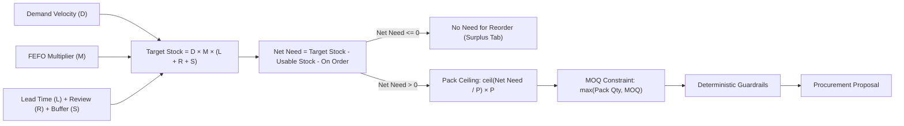

# 💊 MARG Pharmaceutical Procurement Agent

Local-first, human-approved procurement agent for pharmaceutical distribution with MARG ERP as the system of record.

## Features
- MARG Excel ingestion (Closing Stock, Sales Summary, Supplier Master)
- FEFO / expiry-aware inventory classification (90-day horizon)
- Deterministic demand forecasting from sales history
- Procurement policy: target-stock → net-need → pack-rounding → guardrails
- Human-in-the-loop review: Approve / Modify / Reject every suggestion
- Dry-run safe by default — no PO is raised without human approval
- FastAPI backend (port 8000) + Streamlit UI (port 8501)
- SQLite local database (zero setup)

---

## 🧮 Procurement & Reorder Mathematical Formulation

The autonomous procurement engine computes replenishment recommendations using a deterministic inventory policy that coordinates **historical demand velocity**, **supplier lead times**, **FEFO expiry risk mitigation**, and **commercial packaging multiples**.



### 1. Variables & Notation

| Symbol | Definition | Default Value | Notes |
|---|---|---|---|
| $D$ | Daily Demand Velocity | Calculated | Average base units sold per day |
| $L$ | Supplier Lead Time | 45 days | Configurable in UI per run or per supplier |
| $R$ | Review Cycle Frequency | 7 days | Periodic replenishment review window |
| $S$ | Safety Stock Buffer | 3 days | Buffer for delivery fluctuations |
| $C$ | Total Coverage Horizon | 55 days | $C = L + R + S$ (default: $45 + 7 + 3 = 55$) |
| $S_{\text{on\_hand}}$ | Total Physical Stock on Hand | Ingested | Current physical stock from MARG ERP |
| $S_{\text{expired}}$ | Expired Stock | Ingested | Batches where $\text{expiry\_date} \le \text{today}$ |
| $S_{\text{near}}$ | Near-Expiry Stock | Ingested | Batches where $\text{today} < \text{expiry\_date} \le \text{today} + 90\text{ days}$ |
| $S_{\text{usable}}$ | Usable Physical Stock | Calculated | Stock strictly excluding expired and near-expiry units |
| $S_{\text{on\_order}}$ | Pipeline / In-Transit Stock | Ingested | Existing open purchase orders |
| $R_{\text{exp}}$ | Expiry Risk Ratio | Calculated | Fraction of stock at risk of expiry ($S_{\text{near}} / S_{\text{on\_hand}}$) |
| $M$ | Expiry Action Multiplier | Calculated | $0.0$ (Pause), $0.5$ (Reduce), or $1.0$ (Normal) |
| $P$ | Pack Size | 1 or Master | Minimum commercial packaging unit (e.g. 10 tablets/box) |
| $MOQ$ | Minimum Order Quantity | 0 or Master | Minimum order threshold enforced by supplier |

---

### 2. Step-by-Step Mathematical Workflow

#### Step 2.1: Daily Demand Velocity ($D$)
Daily demand is computed across a 90-day historical lookback window ($T = 90$):

$$D = \frac{\sum_{t=1}^{T} \text{qty\_sold}_t}{T}$$

* **Heuristic Fallback:** If sales transactions are absent, demand is estimated from the MARG Reorder Level ($RL$) assuming a 30-day baseline consumption:
  $$D = \frac{RL}{30}$$
* **Stockout Floor Baseline:** If physical stock is zero ($S_{\text{on\_hand}} = 0$) and demand evaluates to zero, a baseline of $D = 0.05\text{ units/day}$ is assigned to prevent permanent stockouts for newly listed or reorder-enabled items.

---

#### Step 2.2: FEFO Stock Classification & Expiry Multiplier ($M$)
Inventory batches are evaluated strictly using **First-Expiry-First-Out (FEFO)**:

1. **Usable Stock ($S_{\text{usable}}$):**
   $$S_{\text{usable}} = \max\left(0, (S_{\text{on\_hand}} - S_{\text{expired}}) - S_{\text{near}}\right)$$

2. **Expiry Risk Ratio ($R_{\text{exp}}$):**
   $$R_{\text{exp}} = \begin{cases} 
   \frac{S_{\text{near}}}{S_{\text{on\_hand}}} & \text{if } S_{\text{on\_hand}} > 0 \\
   0 & \text{otherwise}
   \end{cases}$$

3. **Demand Multiplier ($M$):**
   $$M = \begin{cases} 
   0.0 & \text{if } R_{\text{exp}} \ge 0.50 \quad \implies \mathbf{PAUSE\_PROCUREMENT} \text{ (High expiry hazard)} \\
   0.5 & \text{if } 0.25 \le R_{\text{exp}} < 0.50 \quad \implies \mathbf{REDUCE\_ORDER} \text{ (Moderate expiry hazard)} \\
   1.0 & \text{if } R_{\text{exp}} < 0.25 \quad \implies \mathbf{NORMAL} \text{ (Healthy stock position)}
   \end{cases}$$

---

#### Step 2.3: Target Stock Level
Target stock represents the total inventory required to satisfy demand across the entire coverage horizon ($L + R + S$):

$$\text{Coverage Days} = L + R + S$$
$$\text{Target Stock} = D \times M \times \text{Coverage Days}$$

*With default parameters ($L=45, R=7, S=3$):*
$$\text{Target Stock} = D \times M \times 55$$

---

#### Step 2.4: Net Need & Zero-Reorder Classification
Net need calculates the inventory deficit between required target stock and currently available inventory:

$$\text{Net Need} = \text{Target Stock} - S_{\text{usable}} - S_{\text{on\_order}}$$

* **If $\text{Net Need} \le 0$:**
  $$\text{Recommended Qty} = 0$$
  *The product has adequate or surplus stock. It is automatically routed to the **"No Need for Reorder"** tab in the UI.*
* **If $\text{Net Need} > 0$:**
  *Replenishment is required. The system proceeds to pack rounding and MOQ enforcement.*

---

#### Step 2.5: Commercial Pack Rounding & MOQ Enforcement
Pharmaceutical distributors only fulfill orders in integer multiples of manufacturer packaging units ($P$, e.g., strips of 10, cartons of 24):

1. **Pack Ceiling Rounding:**
   $$\text{Packs} = \left\lceil \frac{\text{Net Need}}{P} \right\rceil$$
   $$\text{Raw Qty} = \text{Packs} \times P$$

2. **MOQ Constraint:**
   $$\text{Recommended Qty} = \max\left(\text{Raw Qty},\; \left\lceil \frac{MOQ}{P} \right\rceil \times P\right)$$

3. **Estimated Purchase Value:**
   $$\text{Estimated Value} = \text{Recommended Qty} \times \text{Unit Cost (P.Rate)}$$

---

### 3. Concrete Worked Examples

#### Example A: Standard Replenishment (Healthy Inventory)
* **Product:** Amoxicillin 500mg Capsules (Pack Size $P = 10$, Cost = ₹45/unit)
* **Demand:** 900 units sold over 90 days $\implies D = 10\text{ units/day}$
* **Inventory:** $S_{\text{on\_hand}} = 100$, Near-Expiry = 0 $\implies S_{\text{usable}} = 100$, $M = 1.0$
* **Pipeline:** $S_{\text{on\_order}} = 0$
* **Parameters:** $L = 45\text{ days}, R = 7\text{ days}, S = 3\text{ days} \implies \text{Coverage} = 55\text{ days}$

$$\text{Target Stock} = 10 \times 1.0 \times 55 = 550\text{ units}$$
$$\text{Net Need} = 550 - 100 - 0 = 450\text{ units}$$
$$\text{Packs} = \left\lceil \frac{450}{10} \right\rceil = 45 \implies \mathbf{Recommended\; Qty} = \mathbf{450\; units}\; (\text{₹}20,250)$$

---

#### Example B: Adequate Surplus (No Need for Reorder)
* **Product:** Vitamin C 500mg Chewable (Pack Size $P = 20$)
* **Demand:** $D = 8\text{ units/day}$
* **Inventory:** $S_{\text{on\_hand}} = 500$, $S_{\text{usable}} = 500$, $M = 1.0$
* **Parameters:** Coverage $= 55\text{ days} \implies \text{Target Stock} = 8 \times 1.0 \times 55 = 440\text{ units}$

$$\text{Net Need} = 440 - 500 = -60\text{ units} \le 0$$
$$\mathbf{Recommended\; Qty} = \mathbf{0\; units}\; \implies \text{Listed under "No Need for Reorder" tab}$$

---

#### Example C: Critical Expiry Risk (Procurement Paused)
* **Product:** Cough Expectorant 100ml Syrup (Pack Size $P = 1$)
* **Inventory:** $S_{\text{on\_hand}} = 120\text{ bottles}$, with $80\text{ bottles}$ expiring in 45 days ($S_{\text{near}} = 80$).
* **Expiry Ratio:** $R_{\text{exp}} = \frac{80}{120} = 66.7\% \ge 50\%$
* **Action:** $M = 0.0 \implies \mathbf{PAUSE\_PROCUREMENT}$

$$\text{Target Stock} = D \times 0.0 \times 55 = 0\text{ units}$$
$$\mathbf{Recommended\; Qty} = \mathbf{0\; units}\; \implies \text{Procurement paused until near-expiry stock liquidates.}$$

---

## Quick Start (One-Click Launchers)

Double-click to automatically set up the environment, install dependencies, and launch the application:

* **macOS**: Double-click [`run_mac.command`](run_mac.command) in Finder.
* **Windows**: Double-click [`run_windows.bat`](run_windows.bat) in File Explorer.

---

## Running Without Docker (Local Python)

### 1. Create virtual environment & install dependencies
```bash
python3 -m venv .venv
source .venv/bin/activate          # Windows: .venv\Scripts\activate
pip install -r requirements.txt
```

### 2. Configure environment
```bash
cp .env.example .env
# Edit .env if you want to change any defaults (lead time, guardrail caps, etc.)
```

### 3. (Optional) Load demo data
```bash
python scripts/generate_demo_data.py
```

### 4. Start the backend (Terminal 1)
```bash
source .venv/bin/activate
uvicorn backend.app.main:app --reload --host 127.0.0.1 --port 8000
```

### 5. Start the frontend (Terminal 2)
```bash
source .venv/bin/activate
streamlit run frontend/streamlit_app.py
```

**Or use the unified launcher (starts both in one command):**
```bash
source .venv/bin/activate
python launcher.py
```

### Access
| Service | URL |
|---|---|
| Streamlit UI | http://localhost:8501 |
| API Docs | http://127.0.0.1:8000/docs |

---

## Running With Docker

### Option A — Docker Compose (Recommended, easiest)
```bash
# Build and start (first run takes ~2 min to download & build)
docker compose up --build

# Stop
docker compose down

# Stop and wipe all data
docker compose down -v
```

### Option B — Plain Docker
```bash
# Build the image
docker build -t procurement-agent .

# Run (data lost when container stops)
docker run -p 8000:8000 -p 8501:8501 procurement-agent

# Run with persistent data volume
docker run -p 8000:8000 -p 8501:8501 \
  -v procurement_data:/data \
  -e DATABASE_URL=sqlite:////data/procurement_agent.db \
  procurement-agent
```

### Access (Docker)
Open your browser **manually** (Docker does not auto-open a browser):

| Service | URL |
|---|---|
| Streamlit UI | http://localhost:8501 |
| API Docs | http://localhost:8000/docs |

### Passing custom config to Docker
```bash
docker run -p 8000:8000 -p 8501:8501 \
  -e DEFAULT_LEAD_TIME_DAYS=7 \
  -e MAX_PROPOSAL_VALUE=500000 \
  -e EXECUTION_MODE=dry_run \
  procurement-agent
```

---

## Safety Defaults
- `EXECUTION_MODE=dry_run` — no real purchase order is sent to MARG until explicitly configured
- `REQUIRE_HUMAN_APPROVAL=true` — every suggestion needs human sign-off
- Max order: 5,000 units / ₹2,50,000 per proposal (configurable)

## Data Flow
```
MARG ERP Excel
    → Upload in UI (Tab 1)
    → Ingestion: Products + Inventory Batches + Sales History + Suppliers
    → Procurement Agent: Demand → Target Stock → Net Need → Pack Round → Guardrails
    → Proposals (Tab 2): Human reviews, corrects qty/supplier, approves or rejects
    → Approved Orders (Tab 3): Export CSV for supplier / MARG import
```

## Do Not Commit
`.env`, credentials, `.venv/`, `*.db`, real MARG export files